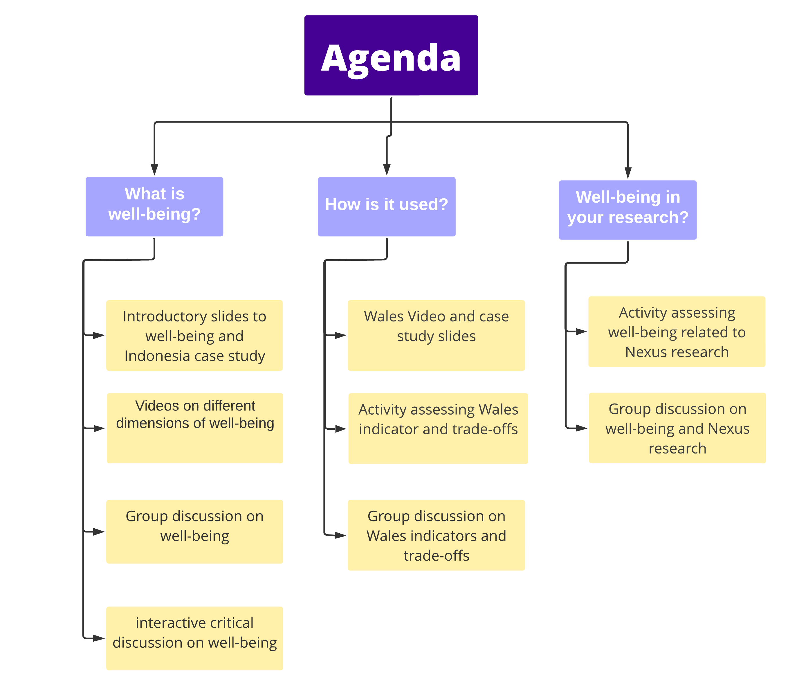

# What is well-being?

# Ocean Nexus
A workshop was held in June of 2021 focused on well-being. Transdisciplinary leaders were brought together to collaborate and facilitate the discussion around well-being and what we can do to make it a focal point in public health. We have now created this space to disseminate what they learned and to hopefully shed some much needed light on this topic.

Our Mission: To contribute to transforming ocean governance through scholarship, communication, and training a transdisciplinary and international network of researchers integrating human-centered tools, perspectives, evidence and narratives.

[Visit Ocean Nexus Center Website](https://oceannexus.uw.edu/)

# Workshop Overview

**Learning Objective:** The goal of the workshop is to encompass and understand a holistic approach to well-being for oceans 

**Goal for Participants:** To recognize and describe multiple framings, definitions, and dimensions of well-being, and assess how these have been and can be applied through a detailed case study

### **Dates**

| ------------- |:-------------:|
| **Day 1**     | June 23, 2021 |
| **Day 2**     | June 24, 2021 |

### Agenda

### Coordinating Team

<!-- prettier-ignore -->

  

  
  
  {{ p[0] }}
  
  
  
  

  

  
  {{ p[0] }}
  
  
  
  
  

  

  
  {{ p[0] }}
  
  
  
  
 

\*primary contact
    

  
### Workshop Team
    
<!-- prettier-ignore -->  

  

  
  
  {{ p[0] }}
  
  
  
  

  

  
  {{ p[0] }}
  
  
  
  
  

  

  
  {{ p[0] }}
  
  
  
  
 

   
### Additional Collaborators
  
<!-- prettier-ignore -->    

  

  
  
  {{ p[0] }}
  
  
  
  

  

  
  {{ p[0] }}
  
  
  
  
  

  

  
  {{ p[0] }}
  
  
  
  
 

