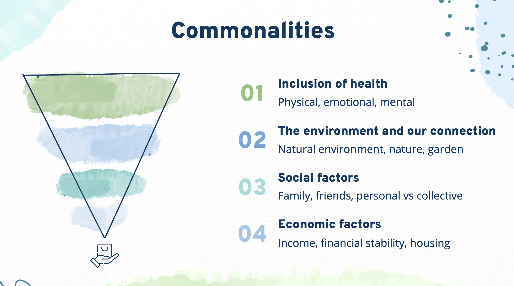
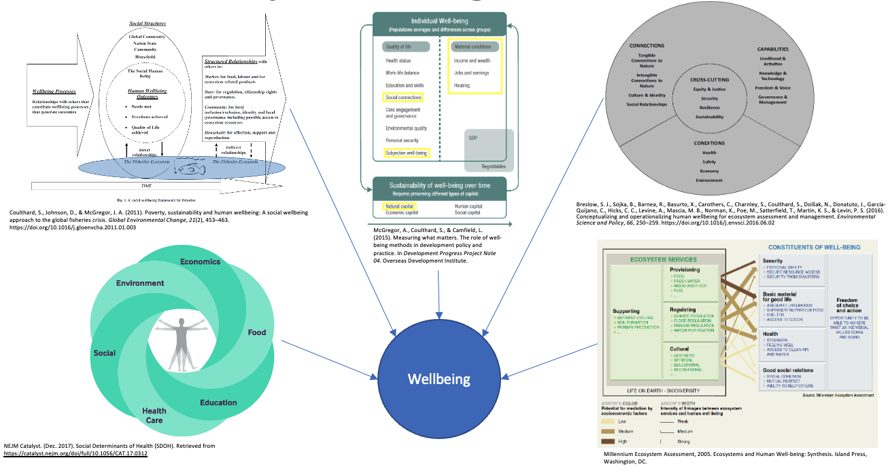

There is no single definition for well-being, so finding connections across diverse populations is a core practice when studying well-being

## **Well-being Frameworks**

There are many different frameworks being utilized world wide to measure well-being outcomes with different sets of domains. Some are as simple as just four broader focuses while others have many more specialized domains on which to focus. 

: "Examples of Well-being Frameworks"

<iframe width="560" height="315" src="https://www.youtube.com/embed/gJ-5MDY_JYw" title="YouTube video player" frameborder="0" allow="accelerometer; autoplay; clipboard-write; encrypted-media; gyroscope; picture-in-picture" allowfullscreen></iframe>
[Introduction Full slides](https://drive.google.com/file/d/1J4RnB_gdYAhd_Ieo9sELwOY1Da3lNOer/view)
